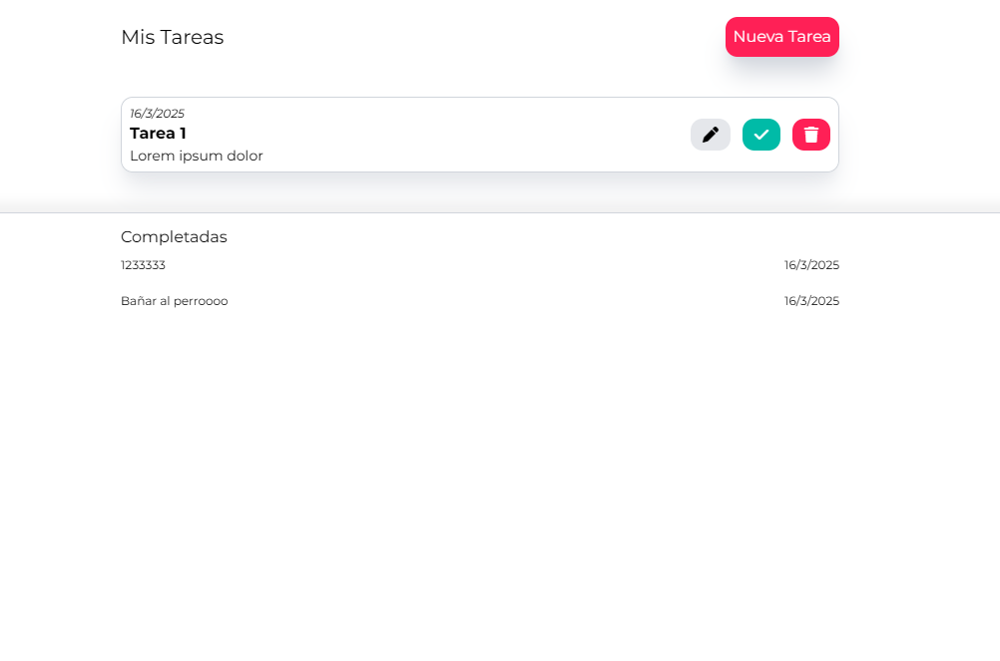

# Proyecto de Lista de Tareas

Este es un proyecto de aplicación de tareas pendientes que utiliza un backend con Node.js y un frontend con React.

## Instalación

Para ejecutar la aplicación, sigue estos pasos:

### 1. Clona el repositorio

En la terminal:
git clone <URL_DEL_REPOSITORIO>
cd <nombre_del_repositorio>

### 2. Ejecutamos el servidor en Express

Desde la raíz del proyecto, en la terminal ejecutamos:
- cd backend
- npm install
- node server.js

### 3. Ejecutamos la aplicación con Vite

Abrimos otra terminal aparte del servidor de Express y ejecutamos:
- cd frontend
- npm install
- npm run dev

### 4. Pegar la URL en su navegador: http://localhost:5173/

- Listo, tenga en cuenta que cuando cierre el servidor, se perderan todos los datos.

## Screenshot

Aquí puedes ver un screenshot de la aplicación en funcionamiento:

